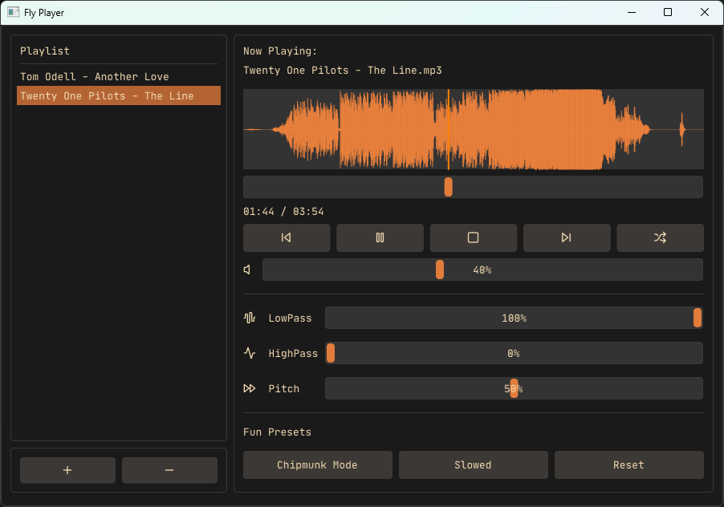

# Fly Player 🎵

A modern audio player built with C++ featuring real-time audio visualization, spatial audio, and advanced audio effects.

<div style="display: flex; align-items: center;">
  
  <span>&nbsp;&nbsp;</span>
  
   <span>&nbsp;&nbsp;</span>
  
</div>



## Features

### Core Audio Features
- 🎵 Support for multiple audio formats (MP3, WAV, FLAC, etc.)
- 📊 Real-time audio visualization with frequency analysis
- 🔊 Spatial audio positioning with 3D sound placement
- 🎛️ Advanced audio effects:
  - Bass and treble control
  - Pitch shifting
  - Volume normalization
  - Fun presets (Chipmunk mode, Slowed mode)

### Playback Controls
- 🎯 Precise seek control with interactive progress bar
- 🔄 Repeat and shuffle modes
- 📝 Playlist management
- ⏯️ Basic controls (play, pause, stop, next, previous)

### User Interface
- 🎨 Modern, clean interface using Dear ImGui
- 📱 Responsive layout
- 🌈 Real-time audio visualization with peak indicators
- 🎮 Interactive spatial audio control panel
- 📁 Built-in file browser

### Audio Engine Features
- 🎧 High-quality audio processing using OpenAL-Soft
- 🔄 Real-time audio streaming
- 🧮 FFT-based audio analysis
- 💫 Smooth audio transitions

## Requirements

- Windows 10/11
- Visual Studio 2022
- vcpkg package manager
- C++20 or later

## Dependencies

- Dear ImGui (with docking branch, this will also be installed along hello-imgui)
- OpenAL-Soft
- libsndfile
- Hello-ImGui

## Building

1. Clone the repository:
```bash
git clone https://github.com/AlexMollard/Fly
cd Fly
```

2. Install vcpkg if you haven't already:
```bash
git clone https://github.com/microsoft/vcpkg.git
cd vcpkg
.\bootstrap-vcpkg.bat
```
3. Integrate vcpkg with Visual Studio:
```bash
.\vcpkg integrate install
```

4. Open `Fly.sln` in Visual Studio 2022

4. Build the solution (F5)
**Note**: The first build may take a while as vcpkg downloads and builds the dependencies for you.

## Usage

1. Launch the application
2. Click the "+" button to add audio files
3. Use the playback controls to manage your music
4. Experiment with audio effects and spatial positioning
5. Enjoy the real-time visualization!

## Audio Controls

- **Volume**: Adjust the overall playback volume
- **Bass**: Control low-frequency response (50Hz - 2000Hz)
- **Treble**: Control high-frequency response (2000Hz - 20000Hz)
- **Pitch**: Adjust playback speed while maintaining pitch
- **Spatial Audio**: Position the audio source in 3D space

## Acknowledgments

- OpenAL-Soft team for the audio engine
- Dear ImGui team for the GUI framework
- libsndfile team for audio file handling
